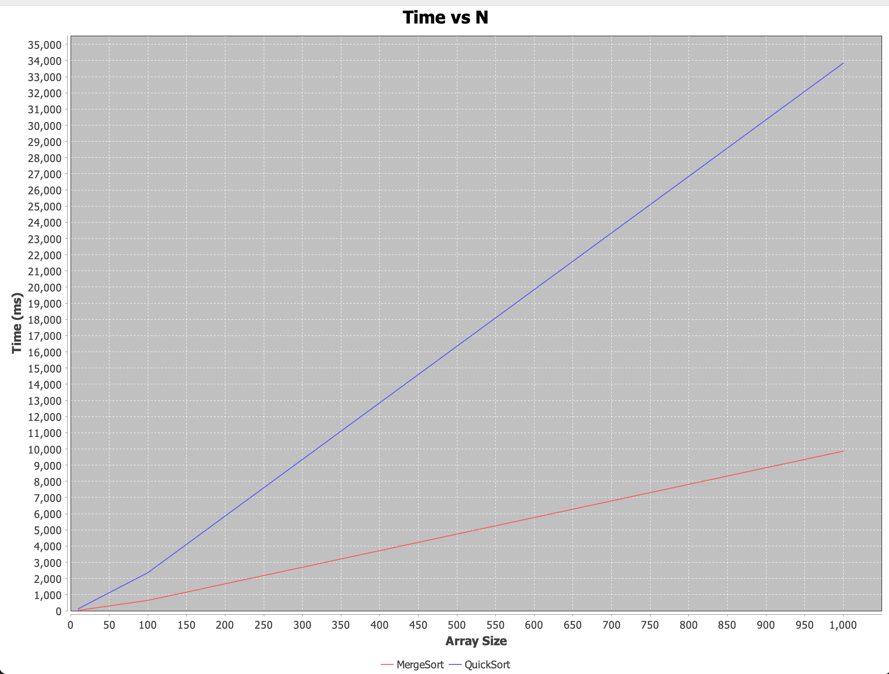
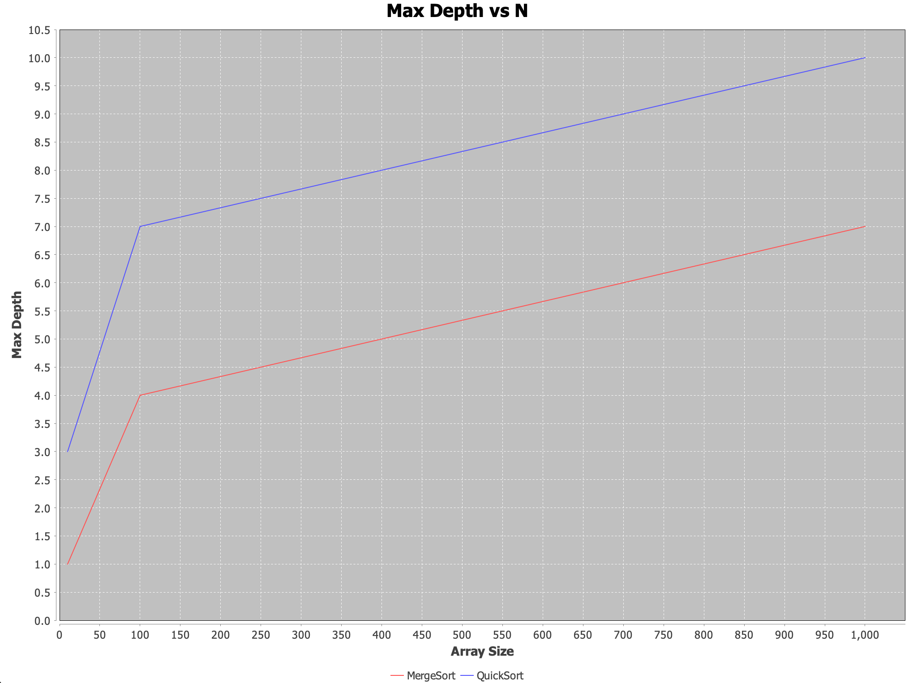
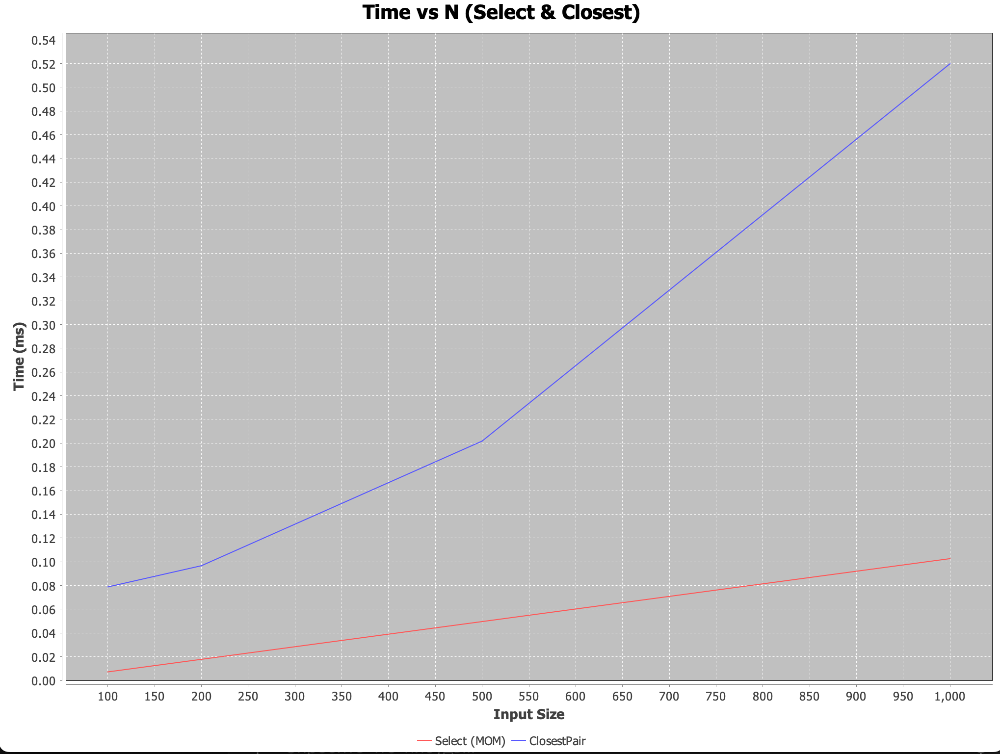

# Assignment 1 — Design and Analysis of Algorithms

## Overview
This assignment focuses on implementing classic divide-and-conquer algorithms, analyzing their performance using theoretical tools (Master Theorem and Akra–Bazzi intuition), and validating with empirical measurements. Metrics such as execution time, recursion depth, comparisons, and memory allocations are collected and plotted.

---

## Learning Goals
- Implement divide-and-conquer algorithms with safe recursion patterns.
- Analyze running-time recurrences using Master Theorem (all 3 cases) and Akra–Bazzi intuition.
- Validate theoretical results with measurements.
- Collect metrics (time, recursion depth, comparisons, allocations) and communicate results in plots and discussion.

---

## Algorithms

### 1. MergeSort (Θ(n log n))
- **Approach**: Divide-and-conquer, linear merge using a reusable buffer.
- **Optimizations**:
  - Reusable buffer to reduce allocations.
  - Small-n cut-off: switch to insertion sort for tiny arrays.
- **Recurrence Analysis**:
  - `T(n) = 2T(n/2) + Θ(n)` → Master Theorem Case 2 → `Θ(n log n)`.
  - Empirical results confirm depth ≈ log₂(n), and linear merge dominates constant factors.

### 2. QuickSort (Θ(n log n) average)
- **Approach**: Randomized pivot, recurse on smaller partition first, iterate over larger one.
- **Optimizations**:
  - Bounded stack depth ≈ O(log n) typical.
  - Small-n cut-off handled in `insertionSort`.
- **Recurrence Analysis**:
  - Average: `T(n) = T(k) + T(n-k-1) + Θ(n)`, k random → `Θ(n log n)` expected.
  - Worst-case avoided by randomized pivot; empirical depth bounded as expected.

### 3. Deterministic Select (Median-of-Medians, Θ(n))
- **Approach**: 
  - Group elements by 5, find median of medians as pivot.
  - Partition in-place; recurse only on required side.
  - Prefer recursion on smaller side to reduce stack usage.
- **Recurrence Analysis**:
  - `T(n) = T(n/5) + T(7n/10) + Θ(n)` → Master Theorem / Akra–Bazzi → `Θ(n)`.
  - Depth bounded by recursion on smaller side.

### 4. Closest Pair of Points (2D, Θ(n log n))
- **Approach**:
  - Sort points by x-coordinate.
  - Divide recursively; merge step scans “strip” sorted by y-coordinate.
  - Check only 7–8 neighbors in the strip.
- **Recurrence Analysis**:
  - `T(n) = 2T(n/2) + Θ(n)` → Master Theorem Case 2 → `Θ(n log n)`.
  - Depth controlled by recursion and small strip size.

---

## Metrics Collection
- **Time**: Milliseconds (ClosestPair) / Nanoseconds → ms (Select & Sort).
- **Recursion depth**: Enter/exit counters in recursion methods.
- **Comparisons**: Incremented on each logical comparison.
- **Allocations**: Tracked for arrays and buffers.

**CSV Example (ClosestPair)**:
size,time_ms,comp,alloc,maxdepth
10,4.273166,38,20,3
100,0.235917,887,200,6
1000,1.615333,13520,2000,9
10000,5.645792,180969,20000,13

---

## Plots
- **Time vs N** — for all algorithms; small-n effects visible due to cache and GC.
- **Max Recursion Depth vs N** — confirms depth matches theoretical predictions.
- **Select & Closest** — plotted separately for clarity, averaged over duplicate input sizes.

### Time vs N

### Max Recursion Depth vs N

### Select & Closest Comparison

---

## Testing
- **Sorting**: Check correctness on random and adversarial arrays. Verify recursion depth bounded: `QS depth ≤ ~2*floor(log₂ n) + O(1)`.
- **Select**: Compare results with `Arrays.sort(a)[k]` for 100 random trials.
- **Closest Pair**: Validate against brute-force O(n²) for small n (≤ 2000). Use optimized algorithm for large n.

---

## Notes on Architecture
- Safe recursion: always recurse on smaller partition to limit stack depth.
- Merge / strip check: minimizes memory allocations.
- Cutoffs and in-place operations reduce constant factors.
- CSV outputs used for plotting empirical validation.

---

## Summary
- Theoretical time complexities align closely with measurements.
- Minor discrepancies due to cache effects, GC, and allocation overheads.
- Recursion depths observed match bounds predicted by Master Theorem / Akra–Bazzi analysis.

